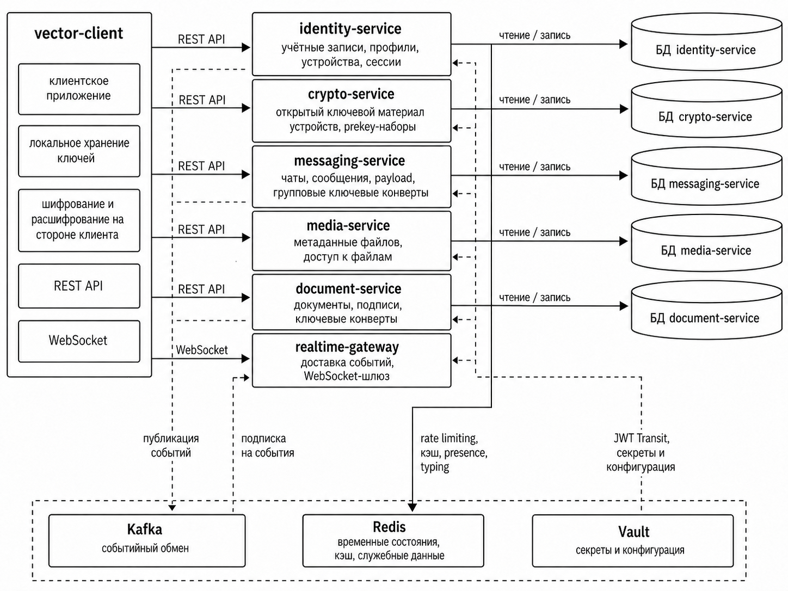
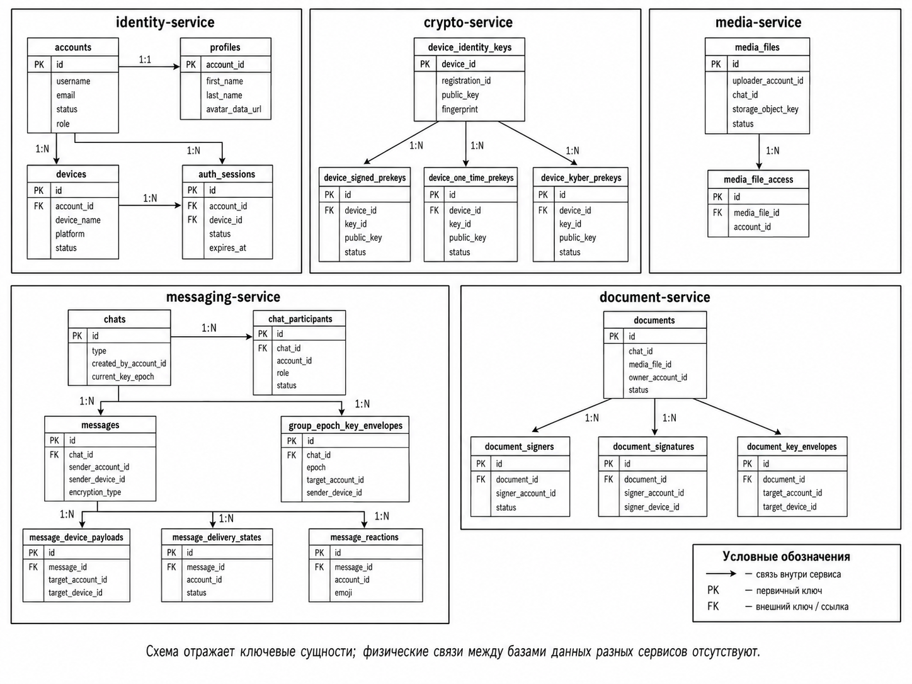
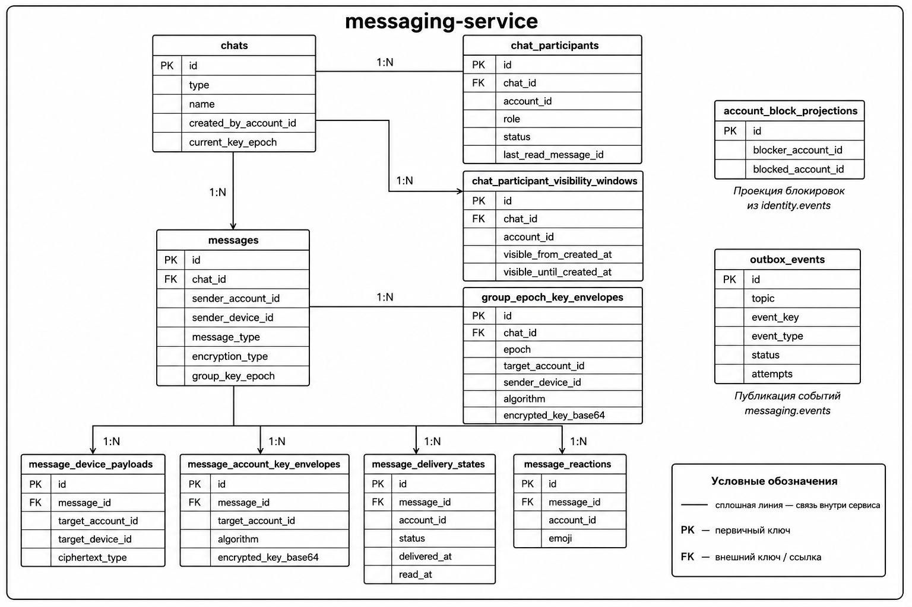

# Vector Backend

Vector Backend — серверная часть защищённого корпоративного desktop-мессенджера.

Система построена как набор независимых Spring Boot сервисов, взаимодействующих через HTTP API и Apache Kafka.

---

## System Architecture



---

## Data Model Overview



---

## Messaging Service Data Model



---

## Состав системы

| Сервис | Порт | Назначение |
|---|---:|---|
| identity-service | 8085 | Управление пользователями, устройствами, сессиями, JWT |
| crypto-service | 8086 | Криптографические материалы, prekey bundles, резервные профили |
| messaging-service | 8087 | Сообщения, диалоги, группы, доставка |
| realtime-gateway | 8088 | WebSocket-шлюз, состояние пользователей, события в реальном времени |
| media-service | 8089 | Зашифрованные медиафайлы и управление доступом |
| document-service | 8090 | Документы, подписи, участники и контроль доступа |

---

## Инфраструктура

Система использует изолированные инфраструктурные компоненты:

- PostgreSQL — отдельная база для каждого сервиса  
- Redis — кэш и rate limiting, изолирован по сервисам  
- Apache Kafka — событийная шина  
- Vault — управление ключами и подпись JWT  
- Kafka UI — наблюдение за событиями  

---

## Инфраструктурные компоненты

| Компонент | Порт | Назначение |
|---|---:|---|
| PostgreSQL identity | 5433 | База identity-service |
| PostgreSQL crypto | 5434 | База crypto-service |
| PostgreSQL messaging | 5435 | База messaging-service |
| PostgreSQL media | 5436 | База media-service |
| PostgreSQL document | 5437 | База document-service |
| Redis identity | 6380 | Rate limiting identity-service |
| Redis crypto | 6381 | Rate limiting crypto-service |
| Redis messaging | 6382 | Rate limiting messaging-service |
| Redis realtime | 6383 | Presence state realtime-gateway |
| Redis media | 6384 | Rate limiting media-service |
| Redis document | 6385 | Rate limiting document-service |
| Kafka | 9092 | Событийная шина |
| Kafka UI | 9090 | Локальная панель Kafka |
| Vault | 8200 | Transit signing key для JWT |

---

## Архитектурные принципы

- Полная изоляция доменных контекстов  
- Event-driven взаимодействие через Kafka  
- Transactional Outbox для гарантированной доставки событий  
- Шифрование данных на уровне домена 
- Отдельные базы данных для каждого сервиса  

---

## Локальный запуск

### 1. Полный запуск (Docker Compose)
```bash
docker compose up -d
```
### Остановка:
```bash
docker compose down
```
### Полный сброс:
```bash
docker compose down -v
```
### 2. Режим разработки (IDE)
```bash
cd identity-service
docker compose up -d

cd ../crypto-service
docker compose up -d

cd ../messaging-service
docker compose up -d

cd ../media-service
docker compose up -d

cd ../document-service
docker compose up -d

cd ../realtime-gateway
docker compose up -d
```
---

## API документация

Swagger доступен только в режиме разработки:

http://localhost:8085/swagger-ui.html
http://localhost:8086/swagger-ui.html
http://localhost:8087/swagger-ui.html
http://localhost:8088/swagger-ui.html
http://localhost:8089/swagger-ui.html
http://localhost:8090/swagger-ui.html

## Actuator
расширенные метрики в dev
ограниченный доступ в production (health/info only)

## Логирование
корреляция запросов через X-Request-Id
трассировка через сервисы и Kafka
исключение чувствительных данных из логов

## Kafka
Используется как основная событийная шина:

identity.events — события пользователей и сессий
messaging.events — события сообщений и доставки
document.events — события документооборота

## Redis
Используется для:

rate limiting API запросов
хранения состояния присутствия пользователей
временных TTL данных

Каждый сервис использует отдельный Redis-инстанс.

## Outbox Pattern
Для гарантированной доставки событий используется transactional outbox:

изменение данных сохраняется в БД
событие сохраняется в outbox
отдельный процесс публикует событие в Kafka

## Безопасность
JWT подписывается через Vault
ключи не хранятся в сервисах
данные передаются в зашифрованном виде
минимизация чувствительных данных в логах
изоляция сервисов и баз данных